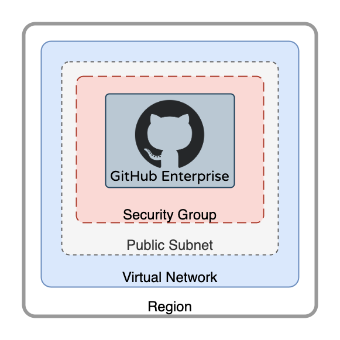
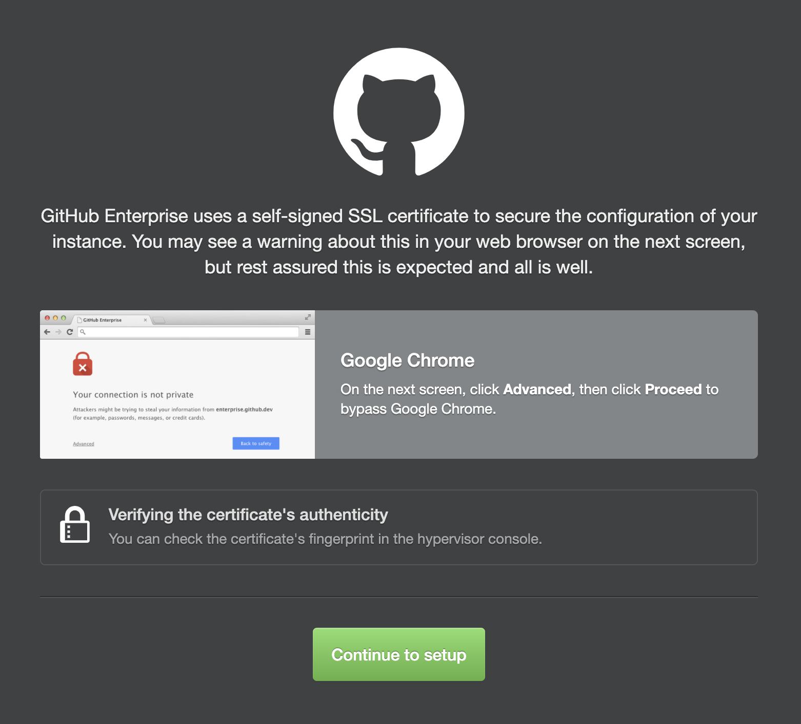
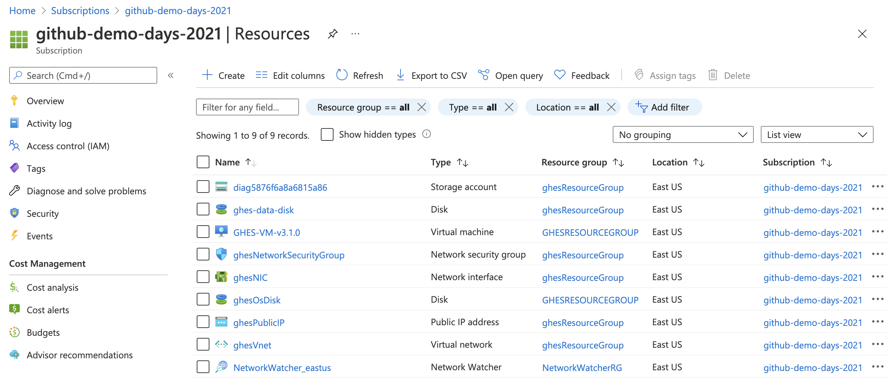

# Demo Days 2021 - How GitHub uses infrastructure as code

##### Top


### An inside look at how the GitHub team uses Infrastructure as Code (IaC) to power a successful unified DevOps platform. 

### We will demonstrate how we use the principles of shared ownership and rapid feedback, empowered by automation, to deploy GitHub safely and reliably at scale


## Overview 

This repository contains the code to build a **Terraform** based, **Hubot** supported, **self-services** IaC setup, on **multiple cloud** environments (Azure, AWS). 

It is meant as an example of what we do in GitHub (at a larger scale).

See the picture below for the workflow overview.


The IaC declaration(s) in this Repository stand up a basic (minimal) GitHub Enterprise Server, of any version that is currently available as an Appliance.

### An example of the basic stack



[:arrow_up: Top](#Top) 


## Requirements

### Terraform

Make sure you have [Terraform installed](https://learn.hashicorp.com/tutorials/terraform/install-cli) on your localhost

### Node / NPM

Install [NPM/Node](https://www.npmjs.com/get-npm)

This is required for Hubot Code.

### Azure Account Access (credentials setup)

You should have an Azure account and setup the local AZ CLI environment, see the [Azure reference](https://registry.terraform.io/providers/hashicorp/azurerm/latest/docs/guides/service_principal_client_secret) for Terraform details.

### AWS Account Access

You should have an AWS account and setup the local AWS CLI environment, see the
 [AWS reference](https://registry.terraform.io/providers/hashicorp/aws/latest/docs#authentication) for Terraform details.

### Hubot

Some useful information on [Hubot](https://hubot.github.com/docs/). 

The Repository already contains a Hubot project, so there should be no need to setup a new project, but this information can provide a better understanding.

### ChatOps

(Slack)

Make sure you have a Slack account, since we are using Slack and the [Hubot Slack adapter](https://slack.dev/hubot-slack/) for this demo (other Hubot adapters are available)

Here are some notes on how to [install a Slack Bot](https://app.slack.com/apps/A0F7XDU93-hubot) (this is a [classic app](https://api.slack.com/authentication/migration#classic)). If you follow the "[install a Slack Bot](https://app.slack.com/apps/A0F7XDU93-hubot)" link it will allow you to install it with some simple steps. Make sure to copy the ***API Token*** (eg. "`xoxb-12345...`")


[:arrow_up: Top](#Top) 


##  Setup

### Step 0: 

#### ...you have cloned this Repoitory :wink:

For simplicity let's assume you cloned it into your **Home-Folder** (`~/`)

### Step 1

#### Setup Hubot with Slack.

> Note: Make sure you completed the **[ChatOps](#ChatOps)** requirements and you now have a Bot **API Token**, as well as seeing a Hubot App in your Slack site.

- Set the Bot **API Token** as an environment variable

    ```bash
    export HUBOT_SLACK_TOKEN=xoxb-12345...
    ```

- Set the **Hubot Logfile** as an environment variable

    ```bash
    export HUBOT_LOG_FILE=~/demo-days-21_IaC-in-github/hubot.log
    export HUBOT_LOG_LEVEL=debug
    ```

- Connect the **Hubot App** with the **Slack Bot**

    ```bash
    cd ~/demo-days-21_IaC-in-github
    ./bin/hubot -a slack
    ```

- The running Hubot App will remain in the forground.
- Go to your Slack page and check the connectivity by going to the hubot App and typing **`ping`**

    

#### If you see this, you are connected !

---

### Step 2

#### Prepare the **IaC** code.

>Note: For this Demo we are "managing" the statefiles locally, in side the Repository. The next step shows the locations of the **state-files** 

- Make sure there are no old ***State-Files*** in the **IaC** folders, there should not be, but just in case.

  - `~/demo-days-21_IaC-in-github/IaC/terraform/ghes/aws/state`
  - `~/demo-days-21_IaC-in-github/IaC/terraform/ghes/azure/state`

    ...these folders should be empty or don't exist.

- Provide connectivity with your cloud provider. For this Demo we use the simple way 
  - for **AWS** provide the **credentials** (~/.aws)
  - for **Azure** use the `az login`

> Note: this is only for demo purposes and not meant for prodcution!

#### With that you should be set on the *"Terraform / IaC"* side.

---

### Step 3

#### Let's run some IaC

> Note: for good measure let's "tail" the Hubot logs, in a separate console.

```bash
tail -f ~/demo-days-21_IaC-in-github/hubot/hubot.log
```

- Tell hubot (in Slack) to run this command

    ```bash
    hubot demo stack build ghes -v 2.22.11 -c azure 
    ```

    > Note: since we are directly communicating with **Hubot**, the initial **'hubot'** statement is optional, as soon as you install the Bot in Slack channels you will have to address the Bot by it's name :smile:

    This command trigger the **IaC** and have Hubot respond with...
    

- This is wat you should expect from hubot (in Slack)...

   

#### After that run finishes we should be in a "happy place!" :smile:

---

### Step 4

#### Let's check what got created

- ### The GitHub WebUI should start with this (...got to bring your licencse :shrug:)

  

<br><br>
- ### The Azure resource-group should look similar to this...

  

---

### Step 5

#### Some IaC items to look at (inside the "box")

- Some details on the **State File(s)**

  Have a look at the state folder

  ```bash
  ls -la ~/demo-days-21_IaC-in-github/IaC/terraform/ghes/azure/state
  ```

  We store each **IaC run-state** under it's **user id** and **version** (eg `jefeish` / `2.22.11`).
  > Note: if you want your users to create only one stack, regardless of the version, just remove the "version" from the [state-file path]().

  ```bash
  state
  └── jefeish
    └── 2.22.11
        └── terraform.tfstate
  ```

   #### Immutable / Idempotent

   - We can destroy the full stack, with all its resources and recreate it at any time
   - We do not create multiple instances of the same version when we re-run the same IaC
   > Note: We do allow for multiple stacks of different versions

<br><br>
---

### This concludes the small Demo Stack / IaC example

 

## ...that's all folks !
<br><br>
[:arrow_up: Top](#Top) 

